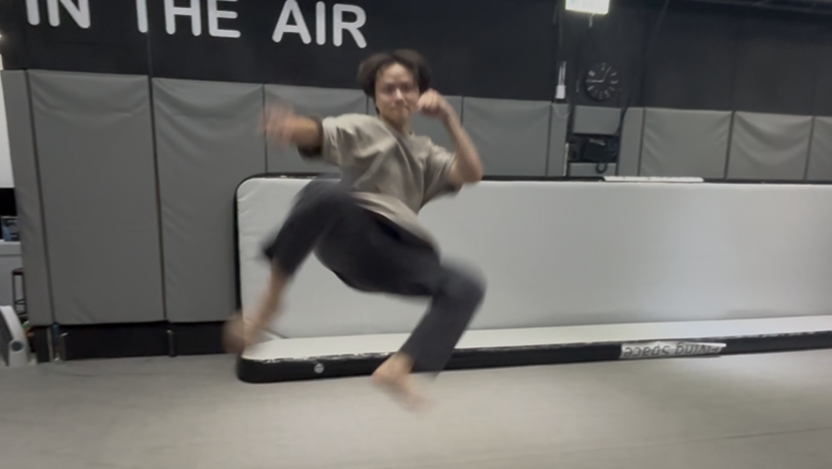
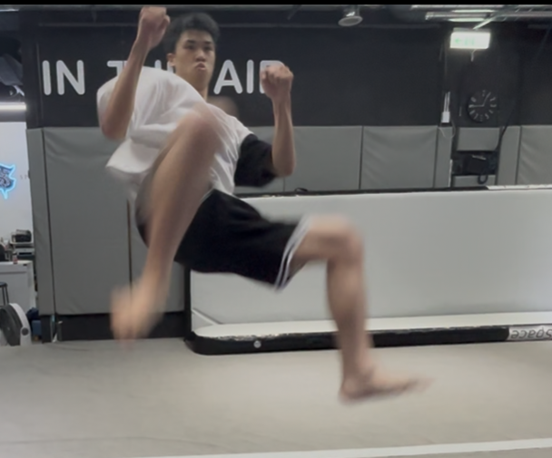
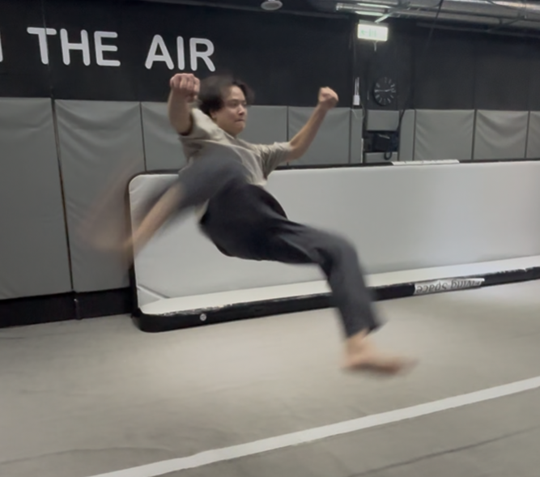
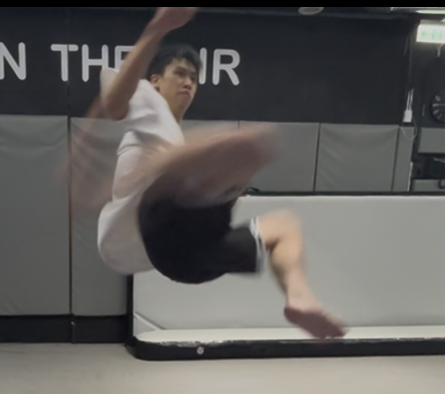
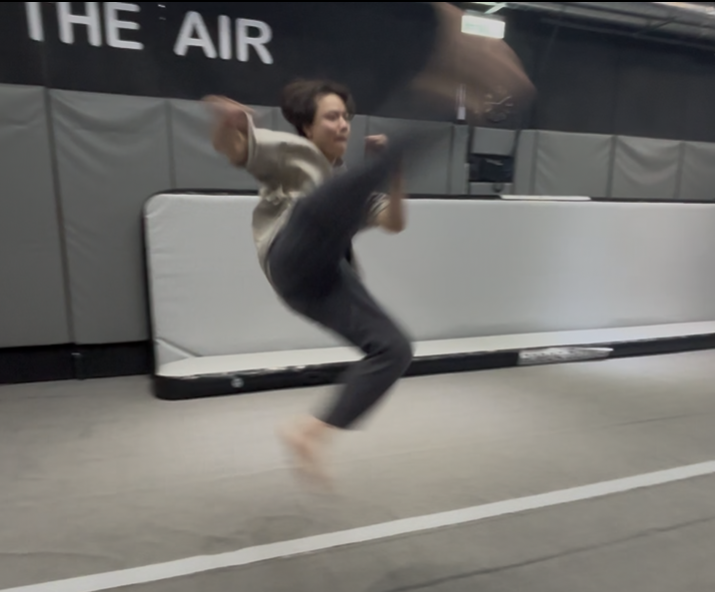
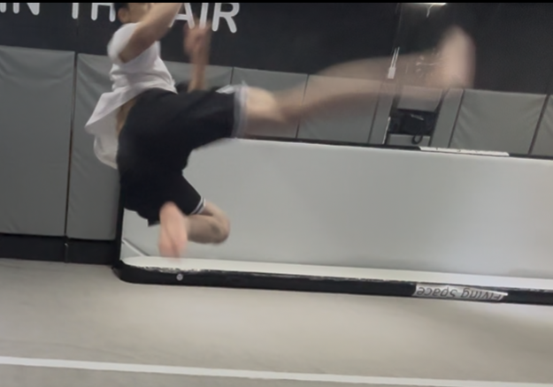
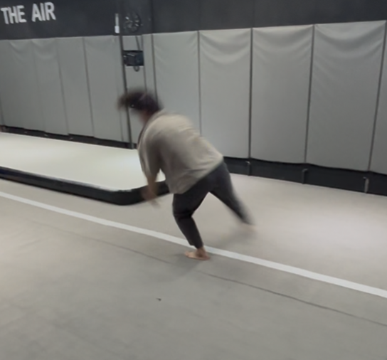
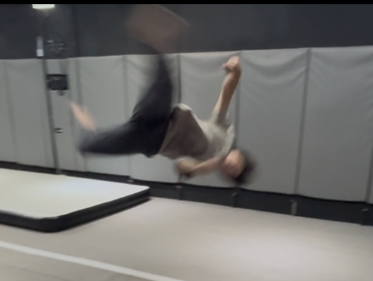
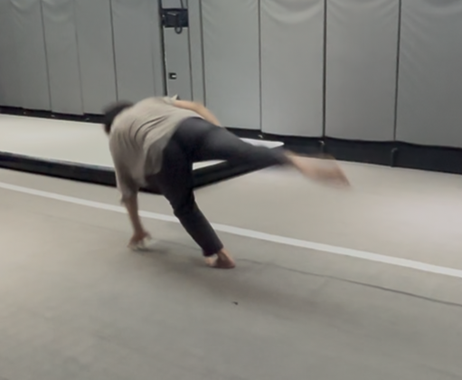
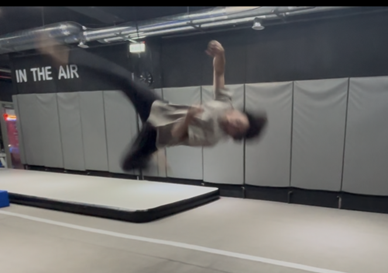

# 75 小傑老師1v1 第一堂課
|Section|Point|
|---|---|
|WarmUp|
|Stretching|
|Skill|找不到一個正確的動力系統，動作都是單獨練；但其實動作都是有一套動力鏈可以貫穿的
|Concept|


## warm up
- 熱身先從“核心”開始
- 核心：正／左／右 棒式（到肌肉開始活躍）
- 跳躍
    - 直腿雙腳跳跳箱：上＆前＆上＆後 來回*6
    - swing跳高 下腳站跳箱 一腳*6
    - 雙腳跳高：不要求直腿、要“抽高”抽到最久
- 倒立
    - 抓腳）空倒立：手貼耳朵（不要太開）、肩膀要推起來（不要塌陷）才會穩
    - 抓腳）雙腿前後分開的空倒立
    - 抓腳）空倒立連推地板*10：手伸直 用肩膀上下直接「彈」（aka我們練腳踝的彈力感）（不要用彎手 那樣是用肌力）
    - 倒立走路：手貼耳朵（太開 手會沒法拿起來）一開始先小幅度蠕動
    - 手上高）雙腳下punch：腳要收回來 不能往後（aka小翻毽子）
    - 手上高）雙腳下＆雙腳彈 直接回倒立：重心（屁股）彈回上去時要送過肩膀才能回倒立，要連續彈＆有回去上倒立才算
- 基本踢
    - 左右 正踢
    - 低身扶牆後踢：手伸直（貼耳朵）扶牆往後站；後踢時 下腳要伸直but上半身不能抬起來（如果伸不直 就是下腳踩太前面）如此才有延伸股前側；後腳踢＆下腳伸直是同時
    - 左右 側踢

> 大問題：核心不足（肌力、感受度都是）

## stretching
- 大劈
    - 先拉「一彎一直」：
        - 先雙手撐手肘：重心放到彎的那邊、但是身體不要整個彎曲歪掉 還是正位；體感以為的腳正位不會是真的正，要用髖的肌肉 把直的那邊往前推＆彎的那邊往後收？；
        - 再左右肩膀貼地：一手持續撐地 另一手從空隙伸直過去帶著該邊肩膀貼地（頭也會）
    - 拉完彎的在拉「全直」：...?
    - 大劈拉完 要能直接直腿往後坐（不彎腳）：這能再拉到股的更深處
    - 坐著大劈拉側向鏈：手貼耳朵 抓另一邊腳 頭貼膝蓋（兩邊）
    - 坐著的大劈雙人拉筋：被拉的開腳 教練在裡面一樣坐著撐開腳（腳掌抵住學生的小腿處），然後兩人抓手；接著教練用力往後，學生要維持上半身挺胸的正位（不能蜷起來）用力抵抗 不要被拉走
        > 這玩意感覺很吃教練的上肢欸
- 正劈
    - 坐著大劈完直接轉正劈
    - 手肘往前貼地 頭碰膝蓋
    - 手往後滿掌摸地（大概會摸在胯下） 肩胛打開 頭往上看

- 趴地板 拉肚子＆跪地板 手伸直
- 拱（圓）胸 身體往前放 變到拉肚子的姿勢

> 問題：左邊股不開
> 問題：很軟 但肌肉沒力控制
## skills
- 先看了 旋踢後旋
### 360/540
- 360
    - 有540的陋習: 腳還沒拉到最高就收下來
    - 改：右膝吸到核心 到最高點再出去 往上踢／左膝收著不要直接放 
        - 
    
    
- 540
    - 一樣是右膝要吸到核心，在「蓋下來」那一瞬間才發力
- 540下來繼續單腳直轉
    - 空中出腳瞬間姿勢 腳不能超出胸口太多（會被帶走）；要往身體下方蓋進來 不要飛出去
        - 
        - 
    - 核心夾著左腳 繼續把旋轉動力順完
- 540沒轉完但是搶回雙腳落
> 要能在空中決定360(雙腳炸開)／540（蓋下來）

> 這個基本功是for 540gyro / raiz twist / snapu swipe / swipe knife，both same power

> 我過往的swipe knife是“翻胸”太多；正確的是不要翻，胸＆肩要一起拉起來飛到最高（超可怕）
### c7(540 hook)
- c7 double（外擺＆外擺）
    - c7 不要做得像jk => 右腳是轉軸 不要吸起來
- c7繼續轉壓到左腳落
    - 外擺腳不出 吸在核心繼續轉 順著到左腳落（aka bt落地）
    - 右腳要維持轉軸（我會飄起來想出踢技 要改）


### gainer
- 在「核心不動」的條件下，swing腳往前伸出去伸到「最遠」（不是最高），身體會自動往後倒
- 大圓swing：我的scoot左右腳混淆 => 「scoot的姿勢」做360，左膝要先抬起來，then右腳往反向踢出去；再進swing ==> **這樣的swing才是畫一個大園**
    - 常見scoot（後勾腳）：由下開始發力 畫了圓很少；gainer偏向往後
        - 
    - 有往後伸直出腳的scoot：由後開始發力 畫了一個整圓；可以飛高高
        - 
- 進更倒置的 gainer
    - 前面的東西都帶順 scoot不猶豫 然後就能拉高
    - 目前還是壓身體 之後要拉身體

### b twist
- bt要飛高高 要練pop360
- pop360
    - 腳不能扭開來（那是後旋），要收著核心那邊 
    - 然後帶成左腳落地 此時身體會被順勢帶下去（因為有核心收緊） => 這就是bt落地
- 然後 先加入壓身體前置 但用pop360感覺去做
- 再來加入後踢腿 飛高高去做

> 因為這邊會上下半身分離 以此推演到直轉的問題

### 直轉
- 直轉：胸口跟跨下 必須維持一直線 不能分離/但也不是蜷縮起來 要直的跟一根棍一樣
- 要練：雙手伸直可以直轉穩/不要手 可以直轉穩

## Concept
### 東西都會有一個動力系統核心 可以一路堆砌達到一次加一點東西就可以持續進化 如此慢慢帶上去
- 目前我們台南的還在老師以前的第一階段 找到一個想法 然後練出形狀
- 但自老師教學後 發現大多數人的身體素質 不是「一個想法」可以練全套的 所以才有這樣的分析系統

### 空翻 跟 其他那些(well, tricking) 是兩套系統
- 空翻只管三件事：起跳順序 空中做什麼 怎麼落地，然後把三件事變成一件事
- 老師之後會教前側後三空翻的
    - tarada grab是後空進（正punch）；側空進會變成aerial semi就出不了後旋

```我的手臂是很欠操嗎哈哈哈 怎麼兩個老師都在操我的上半身```

- [ ] gathering功課：360/540繼續轉、兩者可在空中控
- [ ] scoot gainer
- [ ] btwist
- [ ] 下次任務：全程側錄熱身&拉筋
