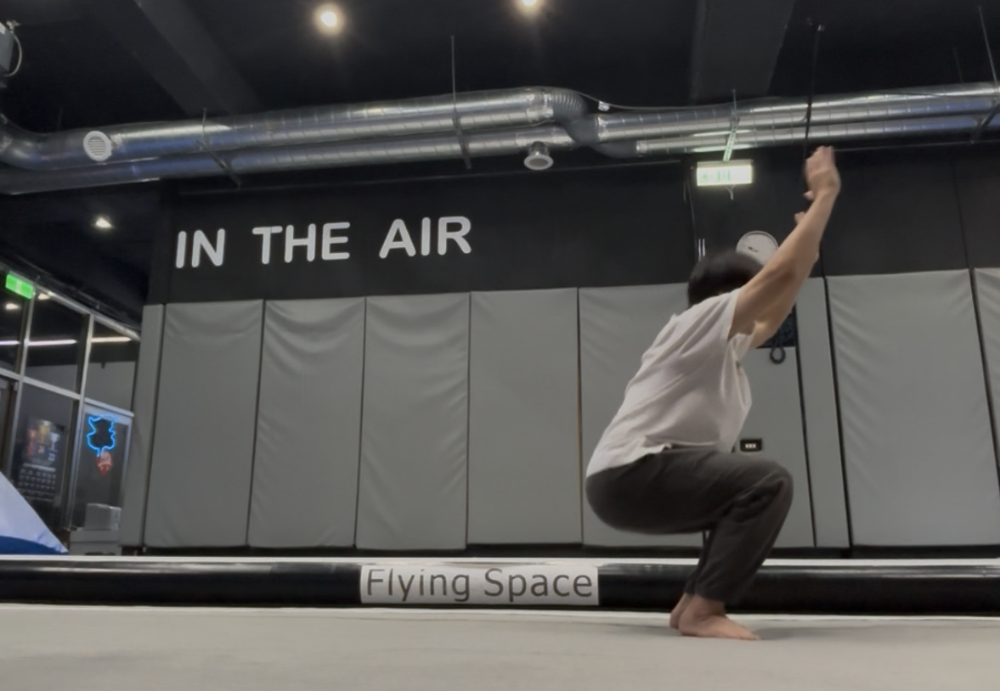
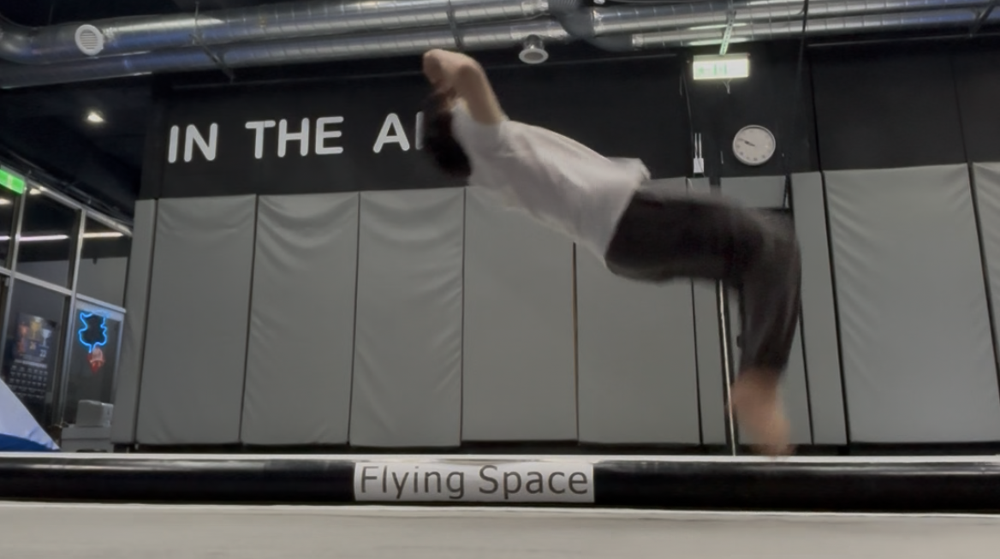
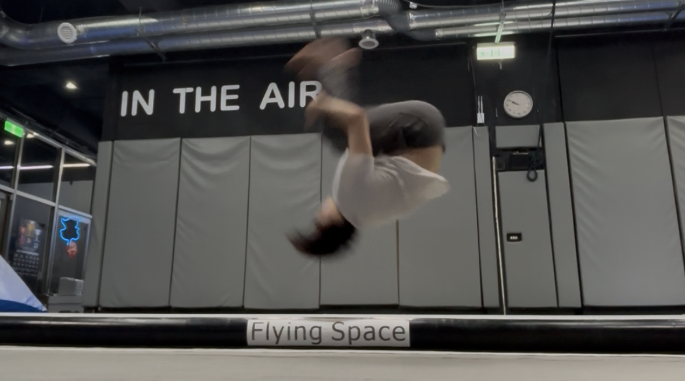
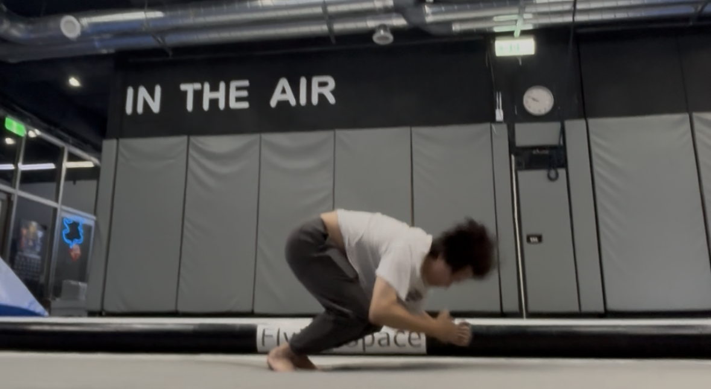

# 726
|Section|Point|
|---|---|
|WarmUp|swing踢|
|Stretch|S循環|
|Trick|側手翻、後空翻|
|Relax|髖關節放鬆循環|
|Concept|🎯一招1000下才能不害怕，用表格記錄進度|

### WarmUp
#### 🎯 需對「基本功」壓量
> - ⚠️ 身體基礎（以平常隨手能做出的動作而論）還在很基本的招式（如360, aerial）
> - 💪 so 需要堆疊更多的肌力＆彈性，才能練習進階的招式（9-series, 10-series, 更多轉體、空翻）
 
#### 核心
> 有待加強
- 基本功持續壓量
- 靠牆踢倒立：✅屁股往牆頂出去 核心收緊；❌核心不能塌陷 身體不要變成彎的

#### jump
- swing協調：s腳「往下伸直」（as踢技）then 垂直往上收
- 正對）雙腳上跳：預備姿勢如「深蹲」，屁股往後拉伸、膝蓋不過腳尖
- 背對）雙腳上跳
    - 後空起跳前置
    - ❌不要想往「後」跳；✅要想垂直跳＆感覺到高度夠了 即可收腳落地

#### 倒立
- 側邊單腳碰牆倒立：肩膀不夠推
    - 💪練習: **爬牆倒立**，✅爬到「胸口貼牆」，練習「整個肩胛往上推」的感覺
- 倒立走路：核心塌陷所以不穩，核心要收緊
#### 兔跳
- 比較好的節奏）肚子主動下拉，同時手就往後推

### Stretch
> 身體有「彈性的底」，但沒有「彈性的功」
- 右腳較弱
> 💪每日拉伸（基礎熱身後再拉 確保肌肉活絡）

#### S拉伸
> ⚠️若學員壓不下去就不要了，不要過度
- 海豹趴🦭
    > 教學輔助🎯：壓腰 把胯下壓進地板
    > 教學輔助🎯：雙膝壓背、雙手扣住腋窩，把學員整個人拉起來（學員手會離地、上半身重量會到教練「手」上）
- 貓趴🐱
    > 教學輔助🎯：壓肩胛骨中間 胸椎處，把胸口壓進地板
- 起來圓胸，回到🦭海豹趴 >（loop）: 完成一個「Ｓ」循環

### cartwheel
> #### 🔥 新節奏＆重心配置
> - 下去時 左手多撐一下（右手不要接那麼快） > 重心過頂 送到左手撐地處的斜前方 > 順勢整個人跟過去 右手下 > 順順站起
> - 比較輕鬆的體感
> - vs. 過去的體感？
#### round-off
- 跟上述側手翻一樣節奏體感，只要在前腳上去時（重心送過去後）> 把後腳併過去 推手 > 就會順落
- 多注意）下腳踢上去
> 今天下來時還沒帶到 兔跳壓肚推手，之後試試

### backflip
> 以下按照順序陳述今天的三階段
#### 1. 旋轉
> **🔥新節奏**：壓肩＆抬腳，換位體感
- 壓肩
    - 預備姿勢）1/4蹲、上半身正位挺直（❌不能前彎）、手放耳朵旁邊伸直
    1. 軟墊）先直接空跳 往後壓肩膀 進軟墊（🎯要求肩膀先到），感受「壓肩」體感
    2. 八角＋軟墊）一樣往後壓肩膀 （可微跳）上八角、大概用中下背的位置撐到，順勢後滾進軟墊 => 整體體感應該是順的
        > ✅ 核心收緊 腳要一樣彎著 收緊跟著換位；❌不能留在下面 再勾上來，這樣就沒有換位到
    3. 教練手保 雙手=八角）一樣的預備姿勢（不用特別起跳），做一樣的事情，壓肩＆抬腳，就能順勢過落地
        - by壓肩＆抬腳，後空是可以蹲著做的
        > - 
        > - 
        > - 
        > - 

> Me: 發現核心不夠力 so上下半身分離 => 收腳要更迅速

#### 2. 起跳
- 放鬆站好 > 垂直1/4蹲，手順勢下甩 > 拉手 回到上面「壓肩抬腳」的後空節奏

#### 3. 落地
> Me
>   - ❌會早拆 腳往「後」戳出去 變成跪/趴落地
>   - ✅ 轉完 落地如深蹲的姿勢（屁股往後拉伸、手往前平衡）站好

- 💪練習：後滾下「低」
    - 25-30cm高的跳箱（剛好頭下垂時 離地尚有一咪咪縫隙）
    - 跟「後滾下高」一樣，躺著、肩膀不超出邊邊、坐姿進後滾
    - ✅ 全程抱好 轉完，🎯：頭會剛好過空間，不會觸地
    - ❌ 若是沒有抱完 中途鬆掉旋轉 => 頭就會觸地
    > 一般的「後滾下高」練習 會腳往後戳開來 順順落地 => but in 後空，這樣會「早拆」；🎯 用「後滾下低」練習後空的後半程落地 不要早拆

### Relax
> ✅ 慢慢去過每個角度，感受「卡住」的地方；❌ 如果很迅速的過，那就是略過了卡住的地方
#### 💪髖關節放鬆loop
- 預備）找一個跟髖同高的平台，一腳站 另一隻腳放上去
1. 彎腿 外翻放在平台上 > 手壓膝蓋往檯面、「核心」用力往外（不是胸口）主動拉伸髖關節
2. 伸直 腳尖朝上 進入「正踢的姿勢（要正胯）」
3. 慢慢轉胯：正胯（正踢） > 側胯（側踢） > 後胯（後踢），全程緩慢 感受每個角度（腳一樣伸直 但要隨著轉 變換面向）
4. reverse, 慢慢轉胯轉回去，回到正胯正踢的姿勢
5. 把腳慢慢彎回來 回到初始姿勢，全程緩慢 感受每個角度
- (loop)

### Concept：1000下，才能不害怕
> - 分配每次練習進度（ex. 4-50下），一招練累了 可以換同系列不同的做
   >  - ex. full/full-hh/full-shuriken/dub full/...
   >  - ex. cork/boxcutter/....
> - 用表格列出詳細菜單，記錄進度＆自動加總當前積累