# 823 jack

## WarmUp

## Stretch

## Trick
### btwist
- 壓身轉腳）旋子
- 壓身轉腳）bt
  - 手進ㄇ字位置
  - 拉跳 再轉
  > - 直接想左腳 持續帶到落地處（是整身體核心 不是外擺
  > - 右腳會觸地（＆隨著練習 漸少）但就只是觸地；不是多跳一下
---
### Raiz
#### pre 1：飛的路徑
1. 面target）右腳站、左腳正抬（伸直）、翅膀手🪽（手直 微微抬 放肩膀以下 身體兩側（不用拉到背後）；但不是bt的ㄇ字）
2.  跳，（右手拉）身體整個面向一起過去（✅左腳一直用核心吃在面前、❌不要翻胸）
3.   落eagle position站好（面back）
#### pre 2：動力步伐
> basically, 360的cheat step
1. ready）左右手一起放back、微蹲
2. 走左腳＆畫左手指向front（右手右腳仍在後面 so身體大字張開）
3. 踏右腳（送重心）＆畫右手，左右手換位帶動身體 => 身體面front＆右手指front 左手指 back
   >⚠️for Raiz不飛離front軌道正向：✅身體面到front, 左右手一後一前；❌身體轉太多、腳踩太多（Me以前 身體會轉到面target背面，so會往旁邊飛）
4. 左手帶，⚠️主動一直拉左腳，「旋」回target，變到 **pre1** 的姿勢
    > - ❌這步還不能跳，✅右腳黏在地上轉過去（❌也不能偷偷墊碎步）
    > - ✅左手帶＆拉左腳是同步（❌左手先走會變翻胸
5. 回到**pre1**）⚠️左腳拉回面到target才能起跳
   > ⚠️左腳一直帶：✅左腳要一直主動帶完整個過程＆ ✅核心要一直把左腳收在身體面前；❌不能一起跳就鬆懈（會回兜 中途滯空墜落，Me之前是這樣）、❌也不能翻開來（左腳脫離身前）
6. 落到eagle position
- 🔥「旋」，用力的拉左腳轉身：如果動力帶順了，3>4 會是 🔥「送重心、踩 旋 跳」（右腳踏＆左腳拉轉身 同步，順著stpe直接拉），才會真正把前置step動力帶進去。

### TDR
#### pre1：跳箱
1. 面對跳箱）身體frontside 右前左後的姿勢（Raiz那個） 蓄力
2. 右手in&屁股上去；左手拉＆左腳旋同步，順勢上跳箱
   > - 🔥一直旋拉：左腳旋＆左手拉 同步，✅左手一直去找地板＆左腳一直旋開來；❌若沒有旋開來 就會卡住（Me之前） 左手吃很重
   > - ✅在撐上跳箱（按手前）胯要面到target／Me以前：❌胯只轉到天上
   > - ✅右腳一直黏在地上（直到被自動拉起）；❌不可偷跳
3. 順順落地
#### pre2：八角
對準八角邊線，動作「一直線」）
1. Raiz前置步，進預備姿勢
2. 帶著動力 進**pre1**

#### 左腳彎彎?
- ✅可，目前重點在flow
- 🔥next step：正常動力大的TDR（畫面大＆張力大，但也不會全直）
    > - 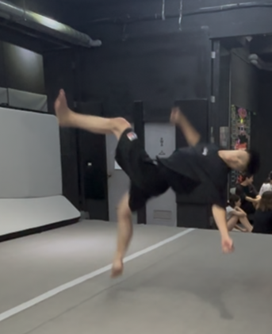
    > - 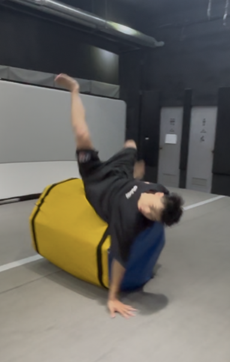
    
### cart front
#### pre1:側手翻>虎跳
1. 側翻順順站：⚠️雙腳落完＆身體應能順勢起身
    > ✅腳全程伸直，重心帶過去；❌不能在中途先彎腳（Me以前），那就會墜落＆雙腳站好but身體還留在彎腰
    > - 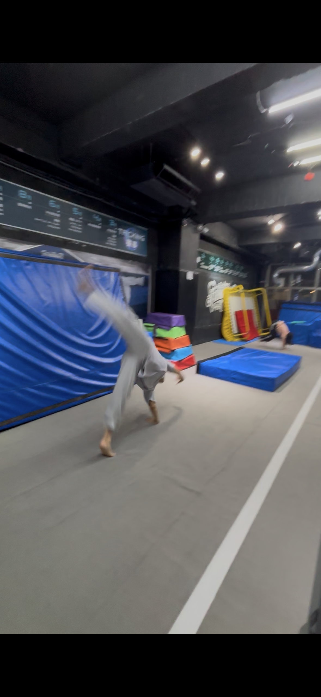
    > - 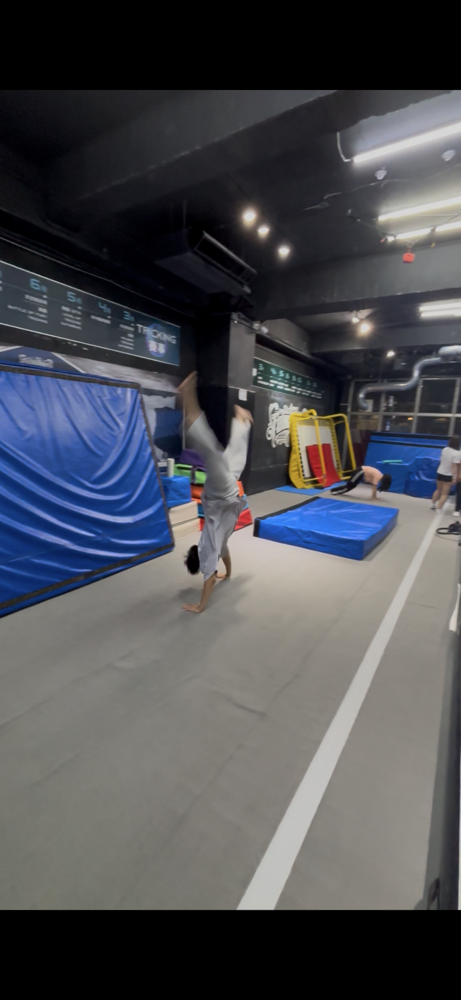
    > - 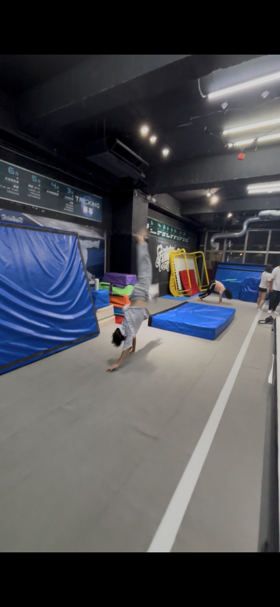
    > - 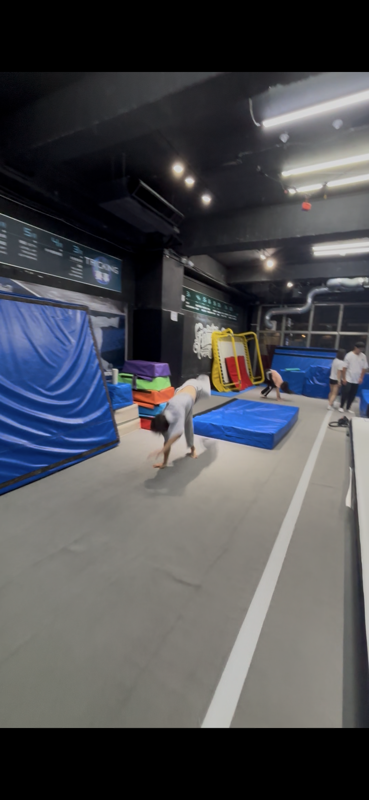

2. 虎跳：側翻起 > （等一下）畫手＆轉到面target > 起跳

#### pre2
1. 虎跳進魚躍
2. 魚躍 在空中團身
> ✅一定要用「魚躍滾」的方式做，❌不要只想空中團 會半途墜落

### cart full
#### pre1：
- 跳箱＆軟墊
1. 半蹲 手伸直放胸前
2. 轉＆跳，側滾姿勢上跳箱
   > 🔥左手要拉、右手要抱，左腰要主動帶轉（aka直轉
    > - 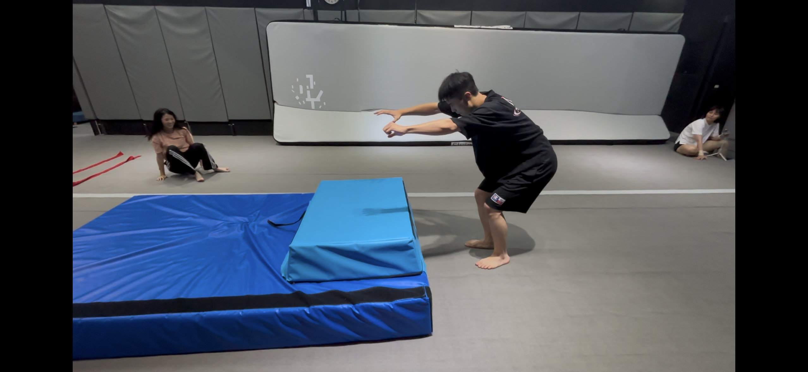
    > - 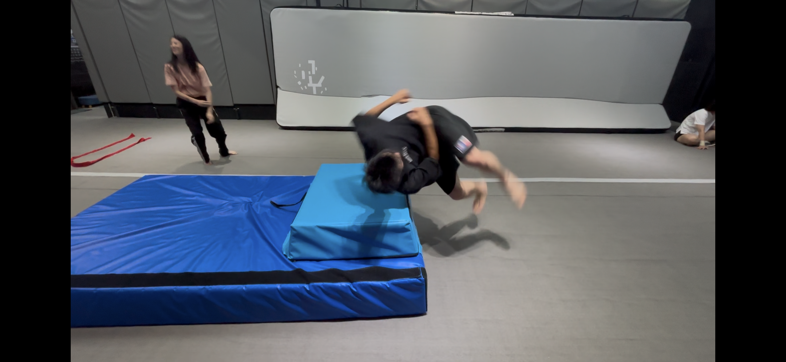
    > - 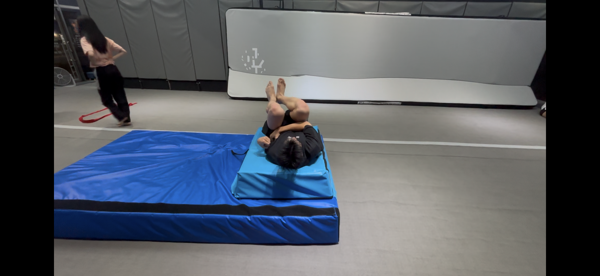
    > - 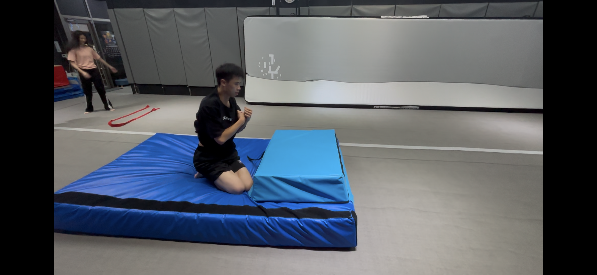

3. 順勢滾落 進軟墊
#### cart進
> ⚠️不需要很大力 應該輕輕的就能做

### vanish
- 🔥旋踢完，右手要順著包進去（回到target），然後就直接轉
> - 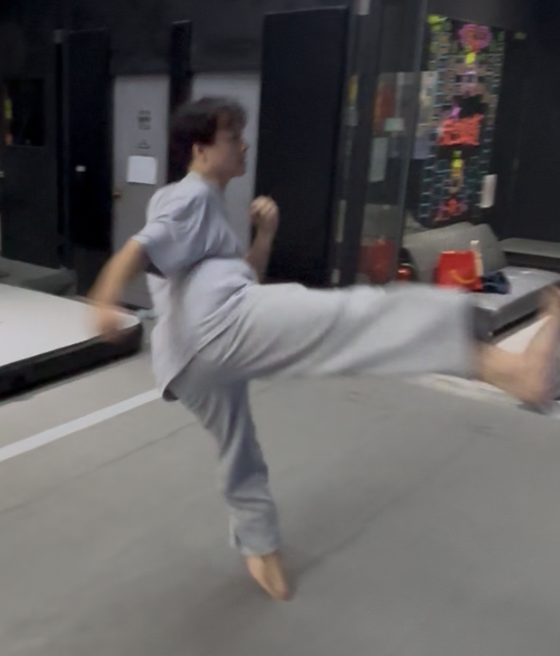
> - 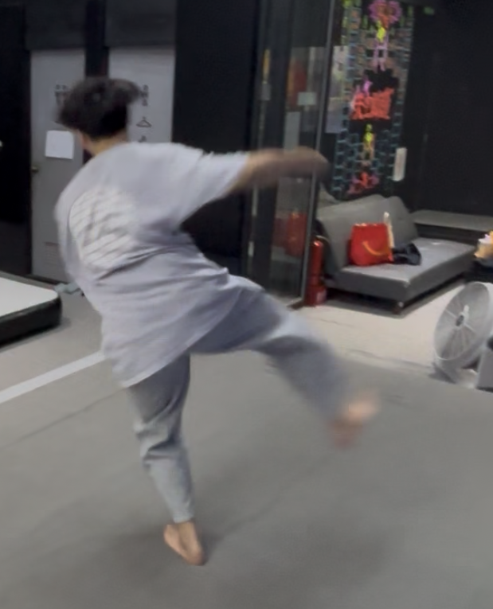
> - 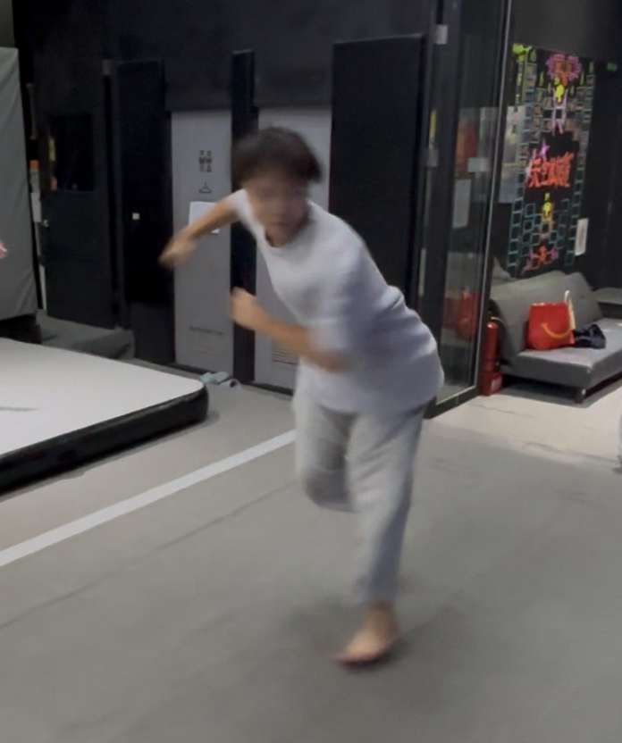
> - 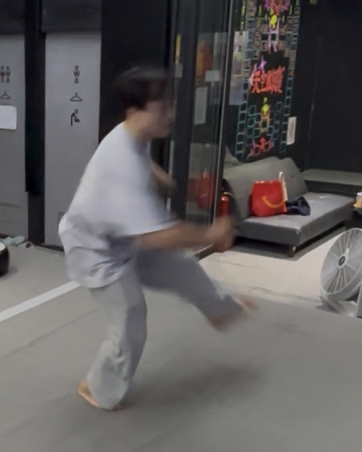
### b10
1. pre:🔥夾直＆外開
2. 直轉＆外開, then順勢出腳
> - 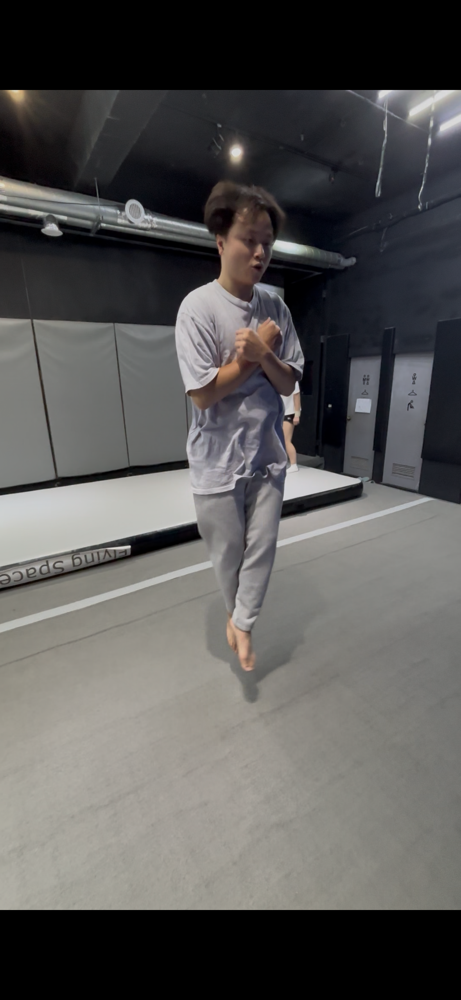
> - 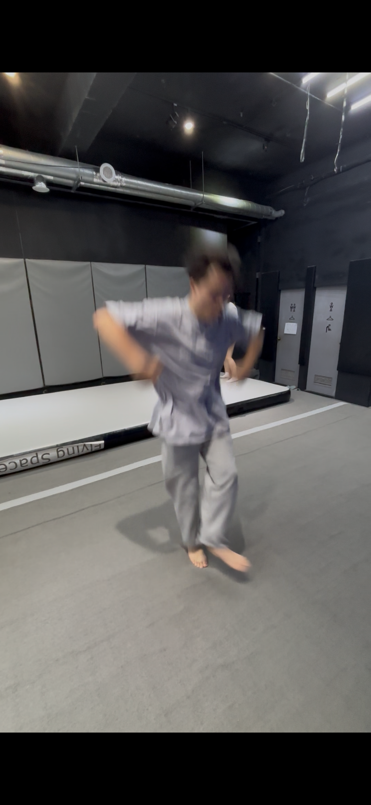
> - 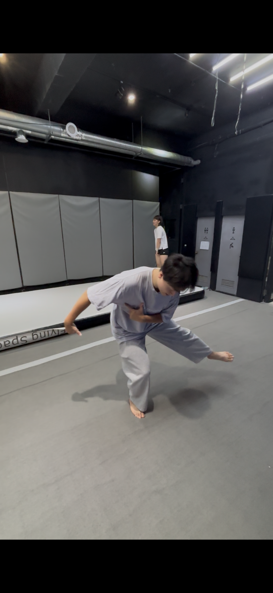

## IDEA
### 未來半年目標 - 招式壓量
- bt, full
- 前空、後空
- Raiz, TDR
### 不需要用「右腳」的
- wrap, vanish
- gainer