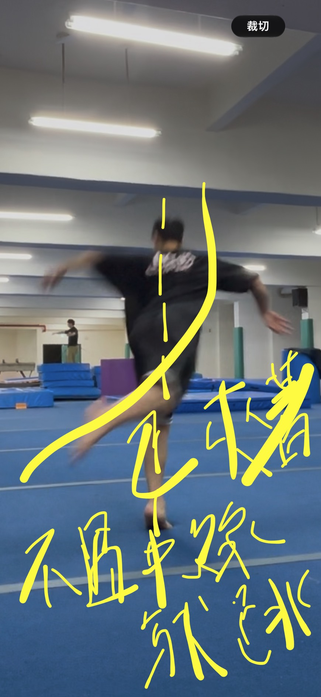
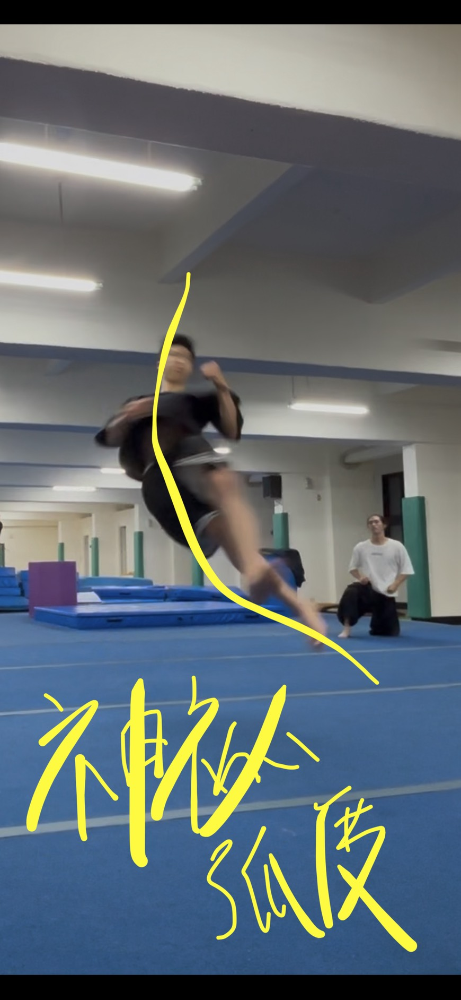

# 10/03 self-practice
### btwist
現在練的直接跳進去 其實不能直接練 本來沒動力 跳進去還是會沒動力

回到分解：
- pop360
- bkick-跳半圈回正面右腳站-再整面身體跳半圈面地板落地
現在練的）bkick跳上去不能再續力 要直接進去（因為到時後是滯空 你不會有動力先去續力

# 10/4 sP
### 不外擺的btwist
#### pre1 pop360前置練法
1. 面正面 > 轉腳90到frontside微蹲 > 起pop360
2. 面backside > 轉腳180到frontside微蹲 > 起pop360
> 🔥guide「右半身旋轉」之step
> 1. 轉完360即可（回到frontside
> 2. 起跳後，⚠️右手抱進去抱到底⚠️ 的360（✅直轉法；❌有些人還沒轉完就放開手＆❌剩下用外擺）（左手在轉軸內側so通常都會默認收好 不用特別注意）
> 3. 起跳後右手抱緊，右腳微微繃直 ⚠️轉右邊核心（@bkick前置練法）、⚠️全身跟著360一起轉的感覺（✅是整個右邊核心一起轉，❌不是只轉髖❌也不是hook的反打那樣腳會被留在後面「卡旋轉」）
> - 👀右邊有沒有一起轉？pop360時，✅身體面向有跟著旋轉＆可以較輕鬆帶全程＆落地時還會有殘餘旋轉 ❌身體面向只「爆發」初始旋轉即停滯＆後續原地墜落
> 4. 成功感受到有多餘旋轉 => 操縱左腳先落、右腳隨後
> 5. 左先右後，落地站好complete位
> 
上述引導帶進前面pre1，就可以做出pop360版的btwist

---
#### pre2 bkick前置法
1. 站正面、ㄇ字、右腳單腳站、左腳抬起 > 用「右半身」跳到背面 看著地板落地
2. 站backside，先跳回正面 > 接1.

#### btwist⚠️
- 正面前壓進去：胸口對齊左腳旋轉、壓抬把胸口拉起來、後踢腿動力
- ✅後踢一起來就要跳了 要把動力吃在「胯下還夾著」的時候 ❌不能等腳飛過身體中線（不然會被帶走）
  - 
- 左手收胸後、右手抱右邊核心，⚠️抱緊轉完全程
---
#### Next step：身體神秘弧度
- 
> 💬就是轉之前的核心直線抓的角度問題。Btwist 重點是離地後轉；那離地前怎麼維持還沒把手的力量用掉，跟離地後先抓到身體跟核心的直線出現，才把手扣旋轉的力量放進去。